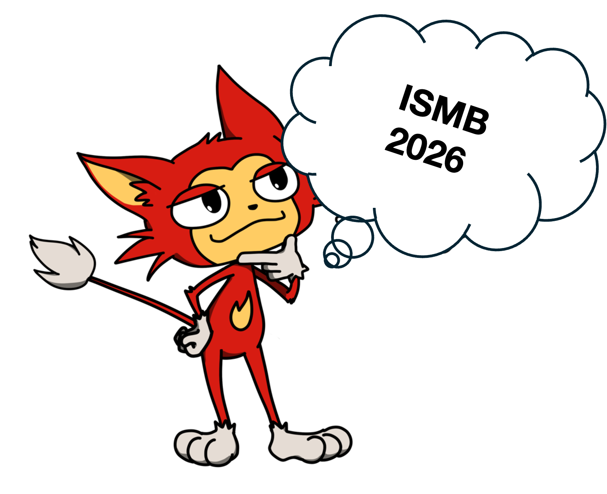

# ISMB 2026 Talks Explorer

Browse the ISMB 2026 talks (and co-located ICBO) by track, search them, and star the ones you don't want to miss. It's one self-contained HTML file that runs offline in any browser.

There are two ways to use it, whichever you prefer:

1. **Open it online** (works on phones too): https://yewon-han-bioinfo.github.io/ISMB2026-talks-explorer/
2. **Download your own copy:** open [ISMB2026-Talks-Explorer.html](ISMB2026-Talks-Explorer.html), click **Download raw file**, then open the downloaded file in your browser.

Talks only; posters aren't listed (ISCB doesn't publish them openly). Data is pulled straight from the official schedules (talk times are EDT, the conference local time), snapshotted 2026-07-14. Stars are saved in your browser.

Repurposed from [woominsong](https://github.com/woominsong)'s skills for ICML2026; thanks for sharing it. Thanks to [luoyunan](https://github.com/luoyunan) for the ideas to bookmark talks and make it work on mobile.

Not affiliated with ISCB/ISMB.

Hope you enjoy ISMB 2026!
